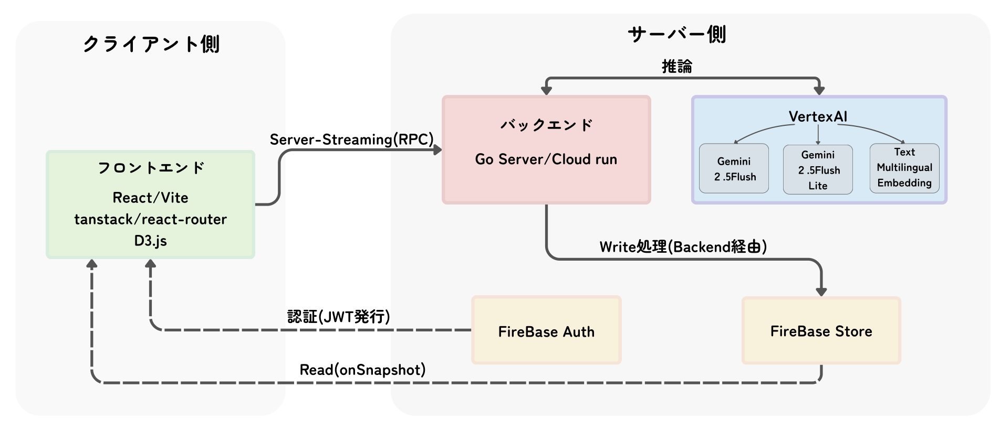
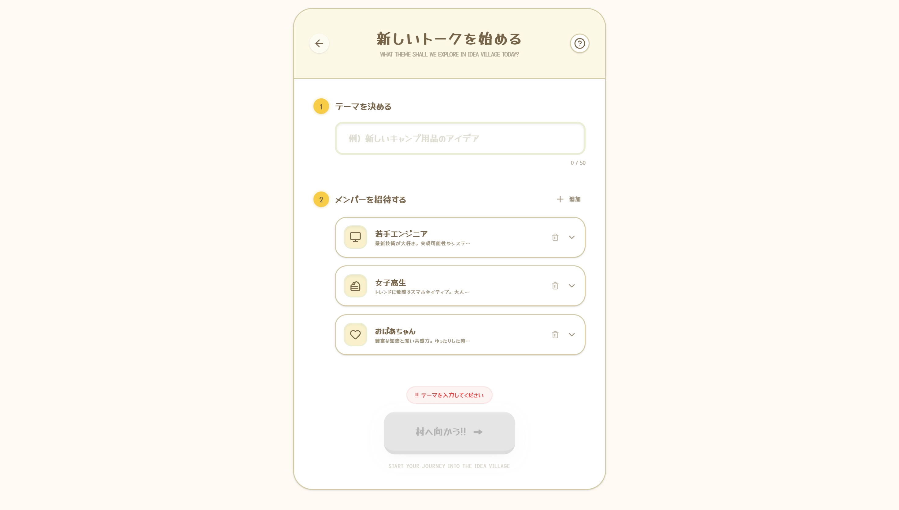
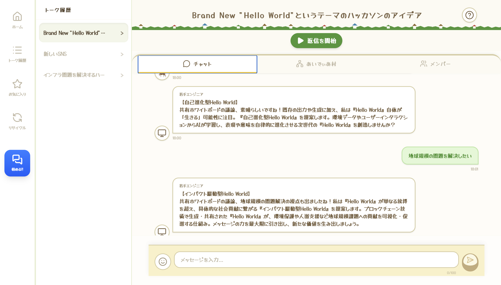
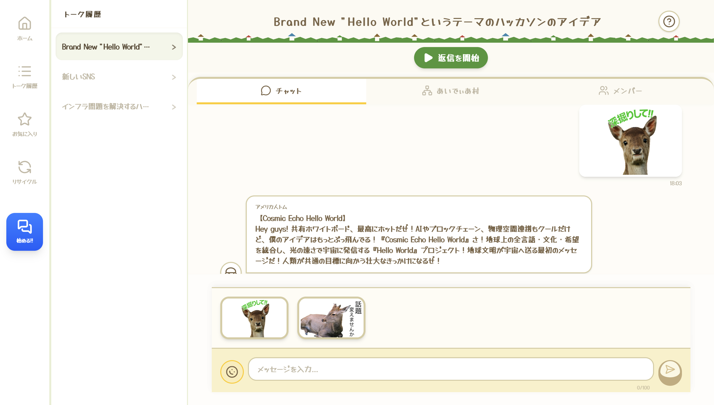
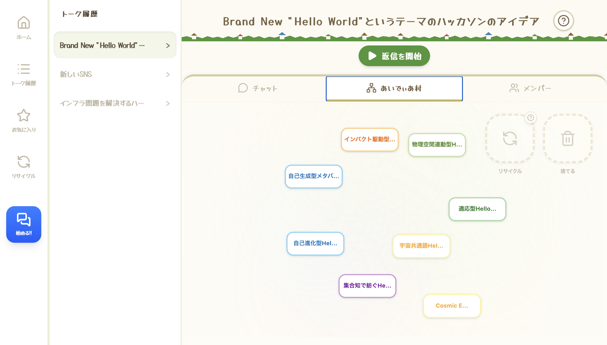

   <h1>あいでぃあ村</h1>
   

🔗 **アクセスはこちらから:** [https://ideerthon.web.app/](https://ideerthon.web.app/)  
*(PC・スマートフォン両対応。Googleアカウントでログインしてお試しください)*

## まとめ（あっさり）

- **モチベ：** もっと簡単で多角的にアイデア出したいなぁ
- **主機能：** せや、AIにロール持たせてAI同士で喋らせたろ。ユーザーが議論に参加できるインターフェースも入れよう！
- **開発：**　 コードはほとんどAIに書かせるために型安全な言語とエコシステムを使おう。AIにはVertexAIを使ってモデルの拡張性を確保しとこう！

   <h3>チャットの様子</h3>
   

   <h3>アイデアマップ</h3>
   

 <h3>全体図</h3>
   

↓↓↓ ここからは詳しい説明

## 1. 製品概要

### モチベーション

生成 AI の登場により、一人でもアイデアを壁打ちやブレストをできるようになりました。しかし、現在のチャット型 AI には「人間が能動的に次の問いを与え続けないと、話が進まない」という致命的な課題があります。人間側が煮詰まってプロンプトが思い浮かばなくなると、AI もまた沈黙し、ブレインストーミングは完全に停滞してしまいます。
そこで，この「一問一答」の壁を打ち破り、「能動的にも受動的にもアイデアを出し続けられる環境を作れないか？」と考えました。

### 製品説明
**あいでぃあ村** は、複数のAIエージェントを対話させることによりアイデア出しを行うブレスト特化のアプリです。

最大の特徴は、ユーザーがシームレスに切り替えられる「受動性」と「能動性」にあります。
- **受動性**：エージェント達が次々と出すアイデアを見て、刺激を受ける事ができる
- **能動性**：スタンプ1つで「深堀り」や「話題変え」を促す事ができる

また、従来のブレストが抱えていた「参加者の属性に偏る」という問題も解決します。

AIエージェントはどんなロールでも引き受けるので、身近に居ない人物の意見を聞くことができます。

### 特長
1. **AIとのグループチャットによるアイデアソン**: AI同士が自律的に進める議論を「ただ眺める」だけで刺激を受けることも、「スタンプ」や「テキスト」を投下して議論の方向を意のままに操ることも可能。人間の心理的ハードルを極限まで下げた新しいブレインストーミングの形です。
2. **アイデアマップによる可視化と整理**: チャットで生まれたアイデアは自動抽出され、物理演算によってアイデアマップ上に浮遊・整理されます。さらに、誰かが捨てたアイデアをランダムに拾い上げる「リサイクル機能」によって、予期せぬアイデアのきっかけを生み出します。
3. **実運用を前提とした高品質なシステムアーキテクチャ**: Connect RPC を活用したマルチエージェント・ストリーミング、コンテキストの動的圧縮による API レート制限・コストの回避、型安全と Lint 統制による堅牢なコードベースなど、エンタープライズを見据えた技術で構築されています。

---

## 2. フロントエンドの画面・機能とこだわり

フロントエンド（React / TypeScript / Vite）は、ユーザーが直感的に AI と対話し、創造性を発揮できる「UI/UX の最適化」と「型安全な堅牢性」を追求しました。

### **① エージェント選択・トーク作成機能**

*   **機能**: 目的に応じて、性格や専門領域（エンジニア、デザイナー、おばちゃんなど）が異なる AIエージェントを複数ピックアップして議論を開始できます。
*   **堅牢・こだわりポイント**:
    *   エージェントのプリセットは TypeScript の厳密な型定義（`AgentPreset`）で管理され、存在しないエージェントを渡すようなバグをコンパイルレベルで防御。
    *   選択されたエージェント情報はそのまま Connect RPC の型付き Request としてバックエンドにシリアライズされるため、不整合が起きない堅牢なフローになっています。

### **② リアルタイム対話（チャット）エリア**

*   **機能**: 参加している AIエージェントたちが次々と意見を交わし、ユーザーもそれに加わるメイン画面です。

*   **堅牢・こだわりポイント**:
    *   **Framer Motion を活用した直感的なリプライ機能**: メッセージバブルを横にスワイプあるいは右クリックするだけで、その発言に対するリプライが可能です。ネイティブアプリのような心地よい触感をWebで再現しました。リプライを行うことで、過去の発言を振り返ったり、特定の話題を深めるなど、柔軟な議論が可能となっています。
    *   **オートスクロールとフォーカス**: リプライ元の発言をタップすると、対象のメッセージへ自動スクロール (`scrollIntoView`) し、さらにハイライト（`ring` アニメーション）を当てることで、長大な会話でも文脈を見失いません。
    *   状態管理は Firestore の `onSnapshot` と React Hooks を連動させ、ネットワーク遅延を感じさせない Optimistic（楽観的）な UI 更新を実現しました。

### **③ 次世代スタンプ UI (非言語介入システム)**
*   **機能**：「この発言を深掘りして」「別の話題に変えよう」といった介入を、文字入力ではなくスタンプ一つで行える機能です。これにより、ユーザはわざわざ文字を入力しなくても議論の方向性を調整できます。

*   **堅牢・こだわりポイント**:
    *   **拡張性を極めた設計**: スタンプのマスターデータ（ID、画像パス、バックエンドに渡す裏のプロンプトテキスト）を `constants/stamps.ts` に完全分離。今後スタンプを100種類に増やしても、この定数ファイルに行を追加するだけで UI と送信ロジックのすべてに自動反映される設計（Open/Closed Principle）になっています。
    *   **スタンプとテキスト処理のバックエンド統合**: フロントエンドから送信されたスタンプは、バックエンド（Go）側で「事前に紐づけられたテキストプロンプト（例：『この話題をもっと深掘りしてください』など）」を持った通常の発言としてパースされます。これにより、テキスト入力とスタンプ送信の両方を**単一のAI処理フローとして完全に統一**し、堅牢なアーキテクチャを実現しています。
    *   **既存のリプライ機能を応用した文脈保持**: スタンプは単発のイベントではなく、常に「対象の発言に対するリプライ」として処理されるよう実装されています。これにより、チャット機能で構築した強固なリプライ機構（対象メッセージのコンテキストを動的注入する仕組み）をそのまま再利用することができ、AIが「今どの話題についてのスタンプなのか」を完璧に文脈把握できる堅牢な設計となっています。

### **④ IdeaMapと物理演算エンジン**

*   **機能**: 会話の中から AI が抽出した「新しいアイデア」を、リアルタイムに俯瞰できるインタラクティブなボードエリアです。これにより、アイデアの関連性を視覚的に把握したりできます。
*   **堅牢・こだわりポイント**:
    *   **D3.js Force Simulation による物理演算**: 抽出されたアイデアは単なるリストではなく、ノードとして画面上で物理的な挙動（反発・引力）を持ちながらフワフワと浮遊します。ユーザーはノードをマウスや指で「ぐりぐり」とドラッグして動かすことができ、触覚的で遊び心のある UX を提供します。
    *   **ベクトル類似度によるノード間の引力**: バックエンドから非同期で生成された Embedding（ベクトル値）をフロントエンドで受け取り、**コサイン類似度 (Cosine Similarity)** を計算。類似度が 0.7 を超える関連性の高いアイデア同士は、自動的に線で結ばれ、互いに引き寄せ合う引力が発生します。
    *   **K-Means 法による自動クラスタリング**: フロントエンド側で K-Means アルゴリズムを走らせ、似たようなアイデア群を最大6つの「カテゴリ」に自動分類。各カテゴリごとに異なる引力点とテーマカラーを割り当て、アイデアの分布を視覚的に整理します。
    *   **ドラッグ＆ドロップでの直感的な整理**: 不要なアイデアを物理的にドラッグして「ゴミ箱」へ投げ入れたり、他の人に共有するために「リサイクルボックス」へ放り込むといった、空間操作ベースの直感的なアイデア整理が可能です。

### **⑤ お気に入り（ピン留め）とジャンプ機能**
*   **機能**: チャット内の気に入った発言やアイデアを個人のお気に入りとして登録し、後から「その発言がされた文脈のチャットログ」へ即座にジャンプして振り返ることができる機能です。
*   **堅牢・こだわりポイント**:
    *   お気に入り一覧から該当のメッセージへ飛ぶ際、対象の DOM 位置を自動計算して滑らかにスクロール (`scrollIntoView`) し、数秒間ハイライトアニメーションを付与。長大なログに埋もれても文脈を瞬時に把握できます。
    *   状態は Firestore 上でユーザーの UID ベースで管理され、ブラウザリロードを挟んでもリアルタイム同期 (`onSnapshot`) により即座に復元されます。

### **⑥ アイデア・リサイクル機能（セレンディピティの創出）**
*   **機能**: アイデアマップ 上で「自分には不要だ」と感じたアイデアをリサイクルボックスに投げ入れてユーザ全体に共有しつつ、**他人がリサイクルした多種多様なアイデアをランダムに眺める**ことができる独自の機能です。
*   **堅牢・こだわりポイント**:
    *   **さらなるアイデアの刺激**: 自分や自分の AI だけでは絶対に辿り着かない「見知らぬ誰かのボツアイデア」を受動的に眺めることで、予期せぬ化学反応が起き、発想がさらに飛躍する仕組みです。
    *   技術的には D3.js のドラッグ要素座標とビン領域の DOM 情報をリアルタイム照合し、マウスが重なるとビンが回転発光するヒット判定を実装。「使わなかったアイデアでも誰かの宝になる」というコンセプトを元に作成されてます。
---

## 3. 実運用に耐えうる堅牢なアーキテクチャと技術的挑戦

本プロジェクトは、単なるハッカソンのプロトタイプに留まらない「即座に実運用可能なレベルでの堅牢性とパフォーマンス」を目標に設計されました。Google のクラウド及びAIインフラを極限まで活用し、高度な技術スタックを採用しています。

### **A. 極限のチューニングを施した AI オーケストレーション**
AI に単なるテキスト生成をさせるのではなく、「自律的な議論の進行役」および「議論の要約・アイデア化を行うファシリテーター」としての役割を、一つのプロンプト呼び出しで実現するシステムを構築しました。

1.  **JSON 構造化出力による思考と行動の分離**
    *   システムプロンプト内で厳密な JSON 出力フォーマット（`message`, `summary`, `ideas`）を指定。AI は「通常の発言」を行いつつ、自己の発言内容を解釈して「過去の要約」と「新しいアイデア名の抽出」を同時に実行します。
    *   これにより、余分なAPI呼び出し（発言用、要約用、アイデア抽出用の3回の呼び出し）を削減し、レイテンシとコストを劇的に抑えています。
2.  **リソース制限に強い多段フォールバック機能**
    *   メインの推論エンジンとして高速かつ高精度な `gemini-2.5-flash` を採用。
    *   APIのレート制限（HTTP 429 / RESOURCE_EXHAUSTED）に達した場合、システムが自動で検知し、軽量な `gemini-2.5-flash-lite` へ即座にフォールバックして再思考するロジックを実装。議論のリアルタイム性を損なわず、いかなる状況でもシステムを落とさないレジリエンスを確保しています。
3.  **非同期のシームレスなベクトル化処理**
    *   アイデアが抽出されるたび、Google の `text-multilingual-embedding-002` モデルを利用してテキストをベクトル（Embedding）化。アイデアごとの特徴を数値化することで、アイデアマップへのマッピングや将来的なアイデアの類似度検索や動的関連付けの布石としています。
    *   この処理はバックエンド言語である Go の強力な並行処理（Goroutine）を用いて完全に非同期で行われ、ユーザーのチャットレスポンスを1ミリ秒も遅延させません。ここでも429エラー時のリトライ機構（60秒のバックオフ待機）を取り入れるなど、万全のエラーハンドリングを施しています。

### **B. 動的コンテキスト圧縮によるインテリジェントなトークン管理**
長時間の議論において、コンテキストの肥大化による「Token Limit (トークン上限)」超過などを防ぐため、バックエンド側で高度なプロンプト構築を行なっています。
最大の特徴は、**入出力の Token 数を会話の長さに依存せず「常に一定」に保っている点**です。API実行1回あたりの原価（コスト）が常に予測可能であるため、将来的に簡単な広告モデル等を導入するだけで、ユーザーがどれだけ長時間ブレインストーミングを行なっても絶対に赤字を出さず、安定的かつ持続可能なサービス運営ができるビジネス上の堅牢性も備えています。

*   **直近の文脈の抽出アルゴリズム**: 会話の全履歴を投げるのではなく、「直近のAI発言2件」と「直近のユーザー発言1件」のみを動的に抽出し、会話のコアな文脈を維持しつつ入力トークン数を劇的に削減。
*   **ターゲットリプライの文脈注入**: ユーザーがスタンプ等で特定の発言に対して「深掘り」や「話題変え」を行った場合、その**対象発言と前後の文脈のみをピンポイントでプロンプトの最重要項目として注入**。限られたトークン内でAIが「何に対して答えるべきか」を完璧に理解させます。
*   **MAX_TOKENS 監視**: 応答の `FinishReason` をバックエンドで監視し、トークン超過による打ち切りが発生した場合はログ出力にて検知可能な体制を取っています。

### **C. Connect RPC を活用した「マルチエージェント・ストリーミング」**
フロントエンド（React/TypeScript）とバックエンド（Go）間の通信に、Google の **Connect RPC (gRPC-Web 互換)** を採用。Protocol Buffers (`.proto`) を単一の情報源とした Schema-Driven Development を実践し、完全な型安全性を実現しました。

*   **サーバーサイドストリーミングによる「議論の牽引」**:
    単なる一問一答ではなく、`Server-Streaming RPC` を活用して **複数人の AI エージェントの連続した対話をオーケストレーション** しています。
    クライアントが一度ストリームを開始 (`StartTalkStream`) すると、バックエンド側で複数のエージェントが順番に思考・発言を行い、その結果を次々とストリームに乗せてフロントエンドへ押し出します。クライアント側のポーリングは一切不要で、自然に進行する白熱した議論を観察・介入できる革新的な UX を実装しました。

### **D. 直感的な UI/UX と Firestore のリアルタイム同期**
*   **Framer Motion による心地よいマイクロアニメーション**: チャットバブルのドラッグでのリプライ操作や、スタンプパネルの滑らかな展開など、ユーザーが「触って気持ちいい」UIを追求。
*   **Firestore `onSnapshot` との併用**: 複雑なトランザクションとAI実行は Connect RPC に任せ、チャットの表示やアイデアマップの更新結果は Firestore のリアルタイムリスナーで状態同期を行う、ハイブリッドなアーキテクチャを採用しています。これにより「システム全体の一貫性」と「画面への即時反映」を両立しました。

### **E. AI と人間の安全な共同開発（Lint による統制）**
「人間と AI (Antigravity 等の開発アシスタント) が共にプロダクトを作る」際に発生しがちな「AIの暴走による破壊的変更」を防ぐため、強力な静的解析を導入。
*   フロントは ESLint＋TypeScript、バックは golangci-lint により、厳格な規約を定義。AI が生成したコードであっても、Lint をパスしなければ反映させない仕組みにより、ハッカソンレベルのアジリティとエンタープライズレベルのコード品質を両立させた開発体制を構築しました。

---

## テスト

---

